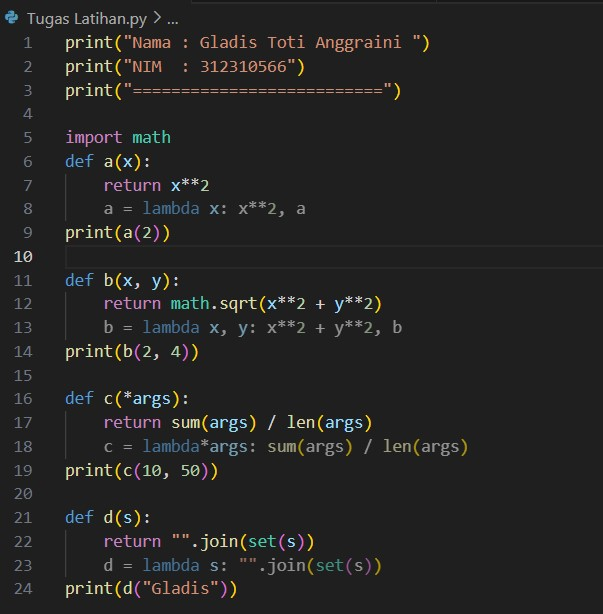
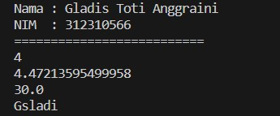
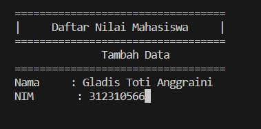
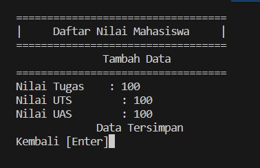
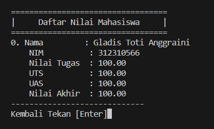
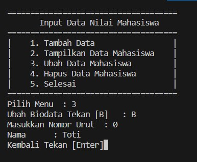
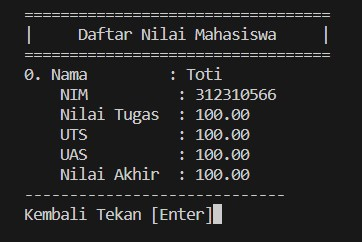
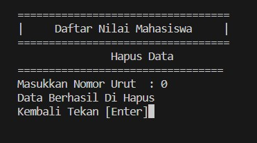
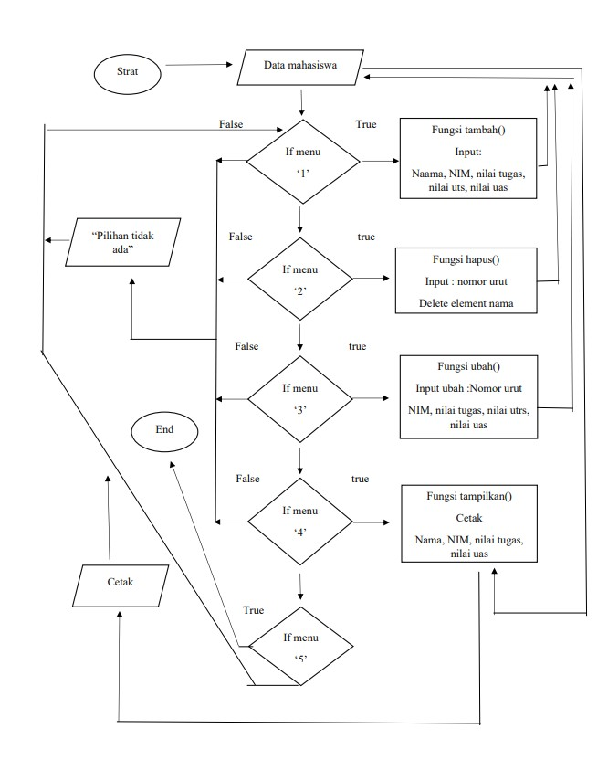

# Praktikum Sub Rutin / Fungsi
>Tugas Praktikum 7 Bahasa Pemrograman | Universitas Pelita Bangsa

| Variable | Isi |
| -------- | --- |
| **Nama** | Gladis Toti Anggraini |
| **NIM** | 312310566 |
| **Kelas** | TI.23.A.5 |
| **Mata Kuliah** | Bahasa Pemrograman |

## Tugas Latihan 
Ubahlah kode di bawah ini menjadi fungsi menggunakan lambda
``````
import math

def a(x):
return x**2

def b(x, y):
return math.sqrt(x**2 + y**2)

def c(*args):
return sum(args)/len(args)

def d(s):
return "".join(set(s))
``````
### Input


```import math
def a(x):
    return x**2
    a = lambda x: x**2, a
print(a(2))
``````
**'Fungsi a(x):'**
<br>a = lambda x: x**2
<br>Ini adalah contoh penggunaan lambda untuk membuat fungsi kuadrat sederhana. Fungsi ini mengambil satu argumen x dan mengembalikan nilai x pangkat 2.

```def b(x, y):
    return math.sqrt(x**2 + y**2)
    b = lambda x, y: x**2 + y**2, b
print(b(2, 4))
``````
**'Fungsi b(x, y):'**
<br>b = lambda x, y: math.sqrt(x**2 + y**2)
<br>Fungsi ini menggunakan lambda untuk menghitung panjang hipotenusa dari segitiga siku-siku dengan panjang sisi x dan y. Fungsi ini mengambil dua argumen x dan y dan mengembalikan nilai akar kuadrat dari jumlah kuadrat kedua sisi.

``````
def c(*args):
    return sum(args) / len(args)
    c = lambda*args: sum(args) / len(args)
print(c(10, 50))
``````
**'Fungsi c(args):'**
<br>c = lambda *args: sum(args)/len(args)
<br>Fungsi ini menggunakan lambda untuk menghitung rata-rata dari sejumlah argumen yang diteruskan ke fungsi. *args memungkinkan fungsi menerima sejumlah argumen variabel.

``````
def d(s):
    return "".join(set(s))
    d = lambda s: "".join(set(s))
print(d("Gladis"))
``````
**'Fungsi d(s):'**
<br>d = lambda s: "".join(set(s))
<br>Fungsi ini menggunakan lambda untuk mengubah string s menjadi string yang hanya berisi karakter unik. Ini dilakukan dengan mengonversi string ke dalam set (yang hanya dapat memiliki elemen unik) dan kemudian menggabungkan elemen-elemen tersebut kembali ke dalam string.
<br>Fungsi set() dalam Python digunakan untuk membuat koleksi tidak terurut dengan elemen yang unik. Setiap elemen dalam set tidak berguna sebanyak kali pun, dan elemen dalam set akan disimpan secara acak setelah setiap elemen unik.

### Ouput


## Tugas Praktikum
Buat program sederhana dengan mengaplikasikan penggunaan fungsi yang akan menampilkan daftar nilai mahasiswa, dengan ketentuan :

- Fungsi tambah() untuk menambah data.
- Fungsi tampilkan() untuk menampilkan data.
- Fungsi hapus(nama) untuk menghapus data berdasarkan nama.
- Fungsi ubah(nama) untuk mengubah data berdasarkan nama.
- Buat Flowchart dan Penjelasan Programnya pada README.md.
-  Commit dan push repository ke github.

### Input 
``````
from os import system
s_nama = []
s_nim = []
s_tugas = []
s_uts = []
s_uas = []
s_akhir = []


def judul():
    print('==================================')
    print('|     Daftar Nilai Mahasiswa     |')
    print('==================================')


def menu():
    system('cls')
    print('=====================================')
    print('Input Data Nilai Mahasiswa'.center(40))
    print('=====================================')
    print('|    1. Tambah Data                 |')
    print('|    2. Tampilkan Data Mahasiswa    |')
    print('|    3. Ubah Data Mahasiswa         |')
    print('|    4. Hapus Data Mahasiswa        |')
    print('|    5. Selesai                     |')
    print('=====================================')
    choose = input('Pilih Menu  : ')
    if choose == '1':
        tambah()
    elif choose == '2':
        tampilkan()
    elif choose == '3':
        ubah()
    elif choose == '4':
        hapus()
    elif choose == '5':
        selesai()
    else:
        tidak = input('Menu Tidak Ada')
        system('cls')
        menu()


def tambah():
    system('cls')
    judul()
    print('Tambah Data'.center(40))
    print('==================================')
    nama = input('Nama     : ')
    s_nama.append(nama)
    nim = input('NIM       : ')
    s_nim.append(nim)

    system('cls')
    judul()
    print('Tambah Data'.center(40))
    print('==================================')
    tugas = float(input('Nilai Tugas    : '))
    s_tugas.append(tugas)

    uts = float(input('Nilai UTS        : '))
    s_uts.append(uts)

    uas = float(input('Nilai UAS        : '))
    s_uas.append(uas)

    total = tugas * 0.30 + uts * 0.35 + uas * 0.35
    s_akhir.append(total)
    print('Data Tersimpan'.center(40))
    kembali = input('Kembali [Enter]')
    menu()


def tampilkan():
    system('cls')
    judul()

    for i in range(len(s_nim)):
        print('%d. Nama         : %s' % (i + 0, s_nama[i]))
        print('    NIM          : %s' % s_nim[i])
        print('    Nilai Tugas  : %.2f' % s_tugas[i])
        print('    UTS          : %.2f' % s_uts[i])
        print('    UAS          : %.2f' % s_uas[i])
        print('    Nilai Akhir  : %.2f' % s_akhir[i])
        print('-----------------------------')
    kembali = input('Kembali Tekan [Enter]')
    menu()


def ubah():
    rubah = input('Ubah Biodata Tekan [B]   : ')
    if rubah == 'B' or rubah == 'b':
        i = int(input('Masukkan Nomor Urut  : '))
        if (i > len(s_nim[i])):
            print('Nomor Urut Salah')
        else:
            namabaru = input('Nama      : ')
            s_nama[i] = namabaru
    kembali = input('Kembali Tekan [Enter]')
    menu()


def hapus():
    system('cls')
    judul()
    print('Hapus Data'.center(40))
    print('=================================')
    i = int(input('Masukkan Nomor Urut  : '))

    if (i > len(s_nim[i])):
        tidak = input('NIM Tidak Ada')
        hapus()

    else:
        s_nim.remove(s_nim[i])
        s_nama.remove(s_nama[i])
        s_tugas.remove(s_tugas[i])
        s_uts.remove(s_uts[i])
        s_uas.remove(s_uas[i])
        s_akhir.remove(s_akhir[i])

    print('Data Berhasil Di Hapus')
    kembali = input('Kembali Tekan [Enter]')
    menu()


def selesai():
    system('cls')


menu()
``````
* Fungsi **'menu()'** ini mencetak pilihan menu dan meminta pengguna untuk memilih opsi. Berdasarkan pilihan pengguna, fungsi ini akan memanggil fungsi lain seperti tambah(), tampilkan(), ubah(), hapus(), atau selesai().
* Fungsi **'system('cls')'** dari modul os untuk membersihkan layar sebelum menampilkan output baru.
* Pada bagian **'if (i > len(s_nim[i]))'**, terdapat sebuah kondisi yang memeriksa apakah nilai dari variabel *'i'* lebih besar dari panjang list **'s_nim'** di index ke-i. Jika kondisi ini benar, maka program akan menampilkan pesan "NIM Tidak Ada" dan memanggil kembali fungsi hapus().
* Menambahkan Data

### Output
<br>
<br>

* Menampilkan Data
<br>

* Mengubah Data
<br>
<br>

* Menghapus Data
<br>

### Penjelasan

1. Definisikan dictionary terlebih dahulu data = {}.
2. Membuat fungsi
    - Fungsi tampilkan(), untuk menambahkan data def tampilkan()
    - Fungsi tambah(), untuk menampilkan data def tambah()
    - Fungsi hapus(nama), untuk menghapus nama pada data def hapus(nama)
    - Fungsi ubah(nama), untuk mengubah nama pada data def ubah(nama)
3. Menggunakan Perulangan *'while True'*: dapat diartikan perulangan akan terus mengulang jika inputan benar dan masuk kedalam proses jika tidak maka perulangan berhenti atau lanjut ke proses selanjutnya. Gunakan statement if untuk memproses perintah yang di inginkan sesuai inputan.
4. Untuk menambahkan data pilih "[1] Tambah" gunakan fungsi if gunakan perintah "1", lalu masukan nama, nim, tugas, uts, uas, nilaiakhir, nilai akhir didapat dari = (tugas)*30/100 + (uts)*35/100 + (uas)*35/100.
5. Lalu jika ingin memilih "[2] Lihat" gunakan fungsi 'elif' dan gunakan fungsi 'for x in data.items():' untuk melihat data pada tabel data yang kita inputkan, dengan perintah "2". Jika data tidak terdaftar maka akan tampil "TIDAK ADA DATA" atau = 0.
6. Lalu untuk menampilan pilihan "[3] Ubah" gunakan fungsi 'elif' kemudian gunakan fungsi 'if nama in data.keys():' kemudian input nama, nim, nilai tugas, nilai uts, nilai uas untuk mengubah data nama kemudian gunakan fungsi 'else' untuk menampilkan data nama yang kita ingin ubah tidak ada.
7. Untuk menghapus data pilih "[4] Hapus" gunakan fungsi 'elif' kemudian gunakan fungsi 'if nama in data.keys():' kemudian fungsi 'del.data[nama] jika nama yang kita hapus tidak ada dalam tabel maka gunakan fungsi 'else' untuk menampilkan "TIDAK ADA DATA".
8. Untuk keluar maka gunakan fungsi else dan exit() atau gunakan perintah [5] Keluar.

## Flowchart


1. start 
2. fungsi menu(), daftar nilai mahasiswa
2. Menampilkan opsi menu.
Mengambil input pengguna untuk opsi menu yang dipilih.
Jika pengguna memilih:
<br>1. Panggil fungsi tambah().
<br>2. Panggil fungsi tampilkan().
<br>3.  Panggil fungsi ubah().
<br>4.  Panggil fungsi hapus().
<br>5.  Panggil fungsi selesai().

2. Fungsi: tambah():
<br>Mengambil input pengguna untuk nama, NIM, dan nilai (tugas, uts, uas).
Menghitung nilai total.
<br>Menambahkan data ke daftar yang sesuai.
<br>Menampilkan "Data Tersimpan."
<br>Menunggu input pengguna untuk kembali ke menu.

2. Fungsi: tampilkan():
<br>Menampilkan data mahasiswa yang telah disimpan.
<br>Menunggu input pengguna untuk kembali ke menu.
<br>Fungsi: ubah():

3. Mengambil input pengguna untuk memilih apakah akan mengedit data.
<br>Jika 'B' atau 'b' dimasukkan, ambil input pengguna untuk indeks yang akan diubah.
<br>Jika indeks valid, ambil input nama baru dan perbarui daftar s_nama.
<br>Menunggu input pengguna untuk kembali ke menu.

4. Fungsi: hapus():
<br>Mengambil input pengguna untuk indeks yang akan dihapus.
<br>Memeriksa apakah indeks valid. Jika valid, hapus data yang sesuai dari semua daftar.
<br>Menampilkan "Data Berhasil Di Hapus."
<br>Menunggu input pengguna untuk kembali ke menu.

5. Fungsi: selesai():
<br>Menghapus tampilan layar.

6. end